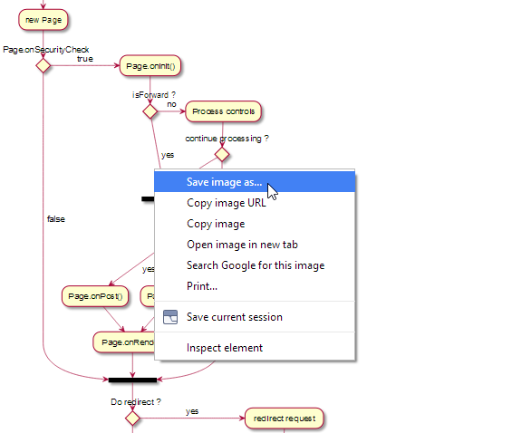

Having a map to get from one place to other is invaluable, if you want to save time, money and avoid frustrations.

The same applies when writing code. Knowing where to start from, and where to finish as well as all the steps you need to take in order to get there, will give you clarity of thought and help you produce better quality code.

[Activity diagrams](http://en.wikipedia.org/wiki/Activity_diagram) are especially well suited for this.

Every task in an activity diagram can either end up being a method or a class (depending on the complexity of the task).

Activity diagrams will help you deconstruct a problem and see patterns emerging **before** you even write a single line of code.

It will help you:

- Add structure to your code and respect the _Single Responsibility_ principle. ([SOLID](http://en.wikipedia.org/wiki/SOLID_(object-oriented_design))

- Visualize your solution and highlight areas where you can [**re-use**](http://en.wikipedia.org/wiki/Reusability) the same code.

It is always good to completely solve a problem conceptually "on paper" before  even writing a single line of code.

The problem I find with most UML applications is that:
- They get in the way of creativity. 
- You find yourself fighting with the tool rather than solving problems.
- They save the diagrams in a binary format, which then makes it impossible to version control, or collaborate with others in a meaningful and productive way.

# PlantUML

This is where [PlantUML](http://plantuml.sourceforge.net/) comes in. PlantUML allows you to create UML diagrams as fast as you can type (or think).

It allows you to define UML diagrams using simple text, which can then be version controlled. 
Collaborating with others on the design of a piece of software has now become easy.

## Easiest and quickest way to get up and running

Here is the easiest and quickest way to get up and running with plantUML.

1. **Do not** install PlantUML. You will however need a copy of the [docs](http://sourceforge.net/projects/plantuml/files/PlantUML%20Language%20Reference%20Guide.pdf/download)
2. Install the [PlantUML Viewer](https://chrome.google.com/webstore/detail/plantuml-viewer/legbfeljfbjgfifnkmpoajgpgejojooj?hl=en) extension for Chrome.

That is it.

Follow these steps to produce a UML diagram:

- Create a new text file. (give it a .uml or .plantuml extension)
- Write the UML description and save the file. (Make sure your file starts with ```@startuml``` and ends with ```@enduml```)
- Drag and drop the file into Chrome.

- Change the PlantUML Viewer settings.

- Update your text file and save. The UML diagram will **automatically** refresh:

- You can save the diagram by right clicking on it:


If you save the image as an SVG file, you can then open it in a [SVG editor](http://www.inkscape.org/en/) and tweak things, if you really-really have to ;)

**NOTE**: This approach has one disadvantage in that you need to have an internet connection to see the diagrams.

You can get around this by installing PlantUML on your computer.

