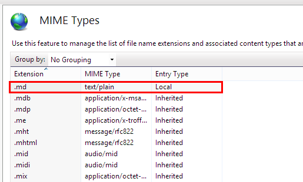

Why ditto
==========

I have been looking for a long time now for a really simple content management system. Or in other words a minimalistic system which would allow me to publish (and manage) content **quickly** and **easily**.

It had to have the following requirements.

Requirements
-------------

- 'Super simple' (TM) to setup and use
- Well structured
- Content must be stored in text files (not databases)
- Can easily be version controlled ( to see what has changed over time)
- Can render markdown files
- Searchable content
- Can be hosted on github pages

All these rquirements have been met by [ditto](https://github.com/chutsu/ditto). I really like how simple and easy it is to setup and use.
To find out more visit their [documentation page](http://chutsu.github.io/ditto/).

What I find interesting is that I have always been disatisfied with the 'blog' offerings, and could never quite put my fingure on "why" until recently.

Why not a blog?
----------------

- Blogs are designed as a diary and are inherntly unstructured
- Good posts often get burried over time (They encourage users to blog often and tend to generate a lot of "noise".)
- I don't intend to write a lot, but what I do write, I want to be able to find quickly. (For some reason I always feel like I am fitting with blogs in order to get to the information I want.)

I am more inerested in a system that will make it easy for me to catalogue my thoughts and allow me to update and refine the content over time.

I don't like wiki's either because they are intrinsincly complex. (They often require a database backend and a fair amount of administration.)

The only disadvantage I have found with ditto is that the content cannot be crwaled by Google. (But since I know how to get to my own content and ditto provides great search functionality I can live with that.)

Setup with IIS
---------------

In order to get ditto to work with IIS on my computer (i.e. so I can quickly see how the pages will be rendered before comitting the changes to github), I only had to include the .md MIME type and associate it with text/plain.

Extras
--------

### Search

One of the features I like most about ditto is that the search functionality actually falls back on the standard github search functionality, which means by default ditto search is extremely powerful and fast!

Here is the link to the advanced github [search page](https://github.com/search/advanced). You can use the same shortcut strings in ditto.

### Environment

Aother great ditto feature is the fact you **don't have to change a thing**, (or compile (build) anything) on your development environment. You can just create content directly in your repository directory and push the changes straight to github. The way the pages look on your localsever will be exactly the same as on github pages.